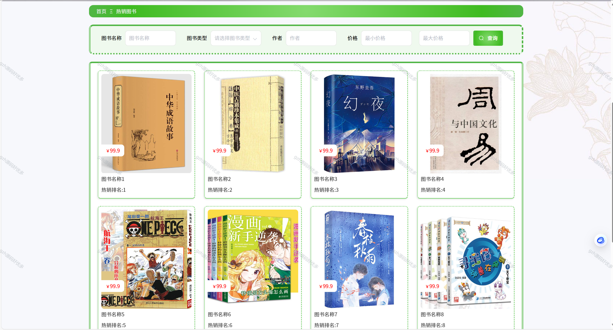

# springbootA244
springbootA244畅销图书推荐系统+LW+PPT
 
## 查看主页获取源码

### 一、关键词
热销图书推荐系统，爆款图书推荐系统，热门图书推荐系统

### 二、作品包含
源码+数据库+设计文档万字+全套环境和工具资源+部署教程

### 三、项目技术
前端技术：Html、Css、Js、Vue2.0、Element-ui 
后端技术：Java、SpringBoot2.0、MyBatis

### 四、运行环境（以下版本亲测，其他版本未知，请自测）
开发工具：IDEA/eclipse  + VSCODE

数据库：MySQL5.7（最低要5.7版本）

数据库管理工具：Navicat10以上版本

环境配置软件： JDK1.8 + Maven3.6.3

前端Nodejs：14

浏览器：谷歌浏览器

### 五、项目介绍
项目编号：springbootA244

讲述了畅销图书推荐系统。结合电子管理系统的特点，分析了畅销图书推荐系统的背景，给出了畅销图书推荐系统实现的设计方案。
主要完成不同用户的权限划分，不同用户具有不同权限的操作功能，在用户模块，主要有用户进行注册和登录，用户可以实现查看图书信息、热销图书、新书资讯，还能修改个人信息等；在管理员模块，管理员可以对用户、图书信息、热销图书、系统和订单等进行相应的操作。

### 六、运行截图

